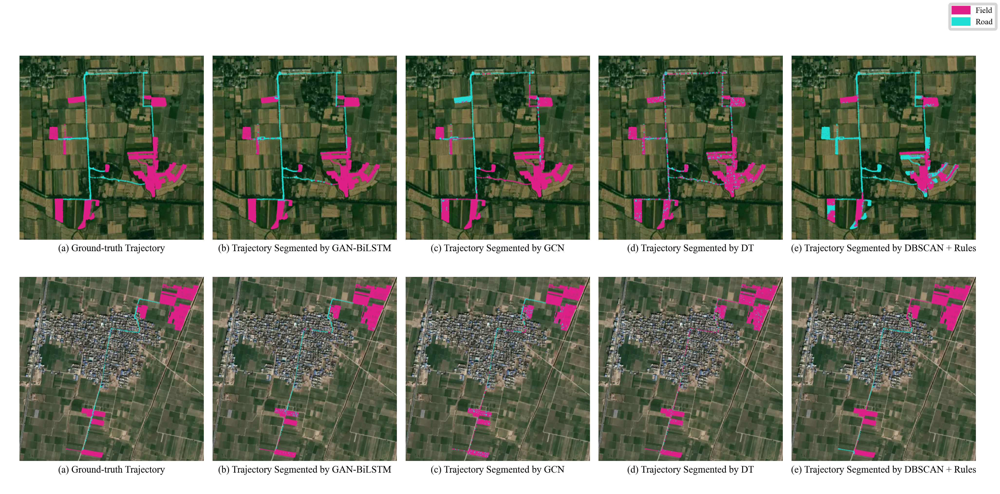

# GAN-BiLSTM Network for Field-road Classification on Imbalanced GNSS Recordings


## 🚀 What's New
- **\[2024.05.20\]** We released the v2 version of the code, which further optimises model robustness.
- **\[2023.12.11\]** We released the code.
## Quick start

```bash
 pip install -r requirements.txt
 python GANBILSTM.py
```

* opt.py for model parameter
* cal_25_feature.py for preprocessing
* GANBILSTM.py for model training and predict
* Visualization.py for trajectory visualization

## Trajectory Results



## Citation

If you use our environment or data, please cite our paper:

```
@article{ZHAI2024108457,
title = {GAN-BiLSTM network for field-road classification on imbalanced GNSS recordings},
author = {Weixin Zhai and Guozhao Mo and Yuzhen Xiao and Xiya Xiong and Caicong Wu and Xiaoqiang Zhang and Zhi Xu and Jiawen Pan}
journal = {Computers and Electronics in Agriculture},
volume = {216},
year = {2024},
issn = {0168-1699},
}
```
